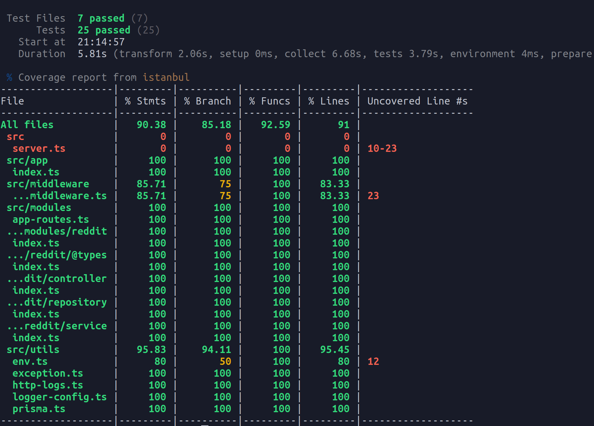

# Winnin challenger

<div align="center">
  <h3>Tecnologias</h4>
  
  
  
  
  
  
</div>

</br>

<div align="center">
  
</div>

> Testes coverage da aplicação

##

# 🚀 Deploy do projeto (pode demorar para carregar)

#### Link da api: <a href="https://winnin-challenger.rms-diego.cloud/" target="_blank">aqui</a>

#### Documentação da api: <a href="https://winnin-challenger.rms-diego.cloud/docs"  target="_blank">aqui</a>

## Pontos de melhorias

- Adicionar persistência para erros no banco de dados
- Criar pipeline de CI
- Criar uma pipeline para CD

## 📄 Requisitos funcionais do desafio

- [x] **Tarefa 1:** Criar modelagem dos dados vindo da API do <a href="https://api.reddit.com/r/artificial/hot" target="_blank">reddit</a>

  - [x] Deve conter um campo com id do post: `id`
  - [x] Deve conter um campo com autor do posts: `authorFullName`
  - [x] Deve conter um campo com o titulo dos posts: `title`
  - [x] Deve conter um campo com a data criação: `createdAt`
  - [x] Deve conter um campo com o número de "ups": `ups`
  - [x] Deve conter um campo com o número de comentários: `commentsQuantity`

**Tabela posts**

```sql
  CREATE TABLE posts(
    "id" VARCHAR PRIMARY KEY NOT NULL,
    "author_full_name" VARCHAR NOT NULL,
    "title" VARCHAR NOT NULL,
    "created_at" TIMESTAMP NOT NULL,
    "ups" INT NOT NULL,
    "comments_quantity" INT NOT NULL,
  );

```

##

- [x] **Tarefa 2:** Criar um cron job para consumir a api do <a href="https://api.reddit.com/r/artificial/hot" target="_blank">reddit</a> uma vez por dia

  - [x] Criar função para fazer o data fetching dos posts do reddit
  - [x] Criar cron job para executar essa função uma vez por dia

##

- [x] **Tarefa 3:** Criar um endpoint para retornar postagens com uma data de inicio e uma data final: `[GET] /posts/range`

  - [x] O endpoint deve ser capaz de receber uma data de inicio `startedAt` via query params
  - [x] O endpoint deve ser capaz de receber uma data de fim `finishedAt` via query params
  - [x] O endpoint deve ser capaz de filtrar posts no entre período passado pelo `startedAt` e `finishedAt`
  - [x] O endpoint deve ser capaz de receber um propriedade para ordenar `sortBy`. Os posts devem ser ordenados em ordem decrescente (Do maior para o menor)
  - [x] Só poderá fazer uma ordenação pela quantidade de `commentsQuantity` ou pela quantidade de "ups" `ups`
  - [x] Qualquer outro valor passado no sortBy que seja diferente de `commentsQuantity` ou `ups` deve retornar um erro
  - [x] Todas essas propriedades são obrigatórias, e devem ser validadas, caso contrario retornar um erro
  - [x] Caso não ache nenhuma postagem deve retornar um erro com a mensagem `no post was found in the range` e o status code de `404`
  - [x] Adicionar propriedade para retornar quantos posts quiser `postsQuantity`, essa propriedade é opcional. Por padrão deverá ser 100 posts
  - [x] Adicionar paginação ao endpoint, deve ser opcional

##

- [x] **Tarefa 4:** Criar um endpoint para retornar postagens ordenadas por uma propriedade: `[GET] /posts`

  - [x] O endpoint deve ser capaz de receber um propriedade para ordenar `sortBy`. Os posts devem ser ordenados em ordem decrescente (Do maior para o menor)
  - [x] Só poderá fazer uma ordenação pela quantidade de `commentsQuantity` ou pela quantidade de "ups" `ups`
  - [x] Qualquer outro valor passado no sortBy que seja diferente de `commentsQuantity` ou `ups` deve retornar um erro
  - [x] Todas essas propriedades são obrigatórias, e devem ser validadas, caso contrario retornar um erro
  - [x] Caso não ache nenhuma postagem deve retornar um erro com a mensagem `no post was found in the range` e o status code de `404`
  - [x] Adicionar propriedade para retornar quantos posts quiser `postsQuantity`, essa propriedade é opcional. Por padrão deverá ser 100 posts
  - [x] Adicionar paginação ao endpoint, deve ser opcional

##

- [x] **Tarefa 5:** "Dockerizar" a aplicação

  - [x] Criar Dockerfile
    - [x] Usar a estrategia de multi stage building
  - [x] Criar docker compose

##

- [x] **Tarefa 6:** Criar documentação da api
  - [x] A documentação deve estar disponível no path `[GET] /docs`

##

- [x] **Tarefa 7:** Criação de testes e test coverage

  - [x] test coverage instanbul
  - [x] criar testes de integração
    - [x] criar testes de integração para o endpoint `[GET] /posts/range`
    - [x] criar testes de integração para o endpoint `[GET] /posts`
  - [x] criar testes unitários
    - [x] criar testes unitários para o controller do reddit o `RedditController`
    - [x] criar testes unitários para o service do reddit o `RedditService`
    - [x] criar testes unitários para o repository do reddit o `RedditRepository`

##

- [x] **Tarefa 9:** Fazer deploy da aplicação

## 💻 Pré-requisitos para rodar o projeto

Antes de começar, verifique se você atendeu aos seguintes requisitos:

- Ter o node instalado na versão 20.16 ou superior
- Criar o arquivo `.env` conforme o arquivo `.env.example`
- Ter o docker e docker compose plugin instalado
- Ter uma instancia do postgres rodando

## ▶️ Rodando localmente

**instalando as dependências do projeto**

```
npm ci
```

**Rodando as migrations**

```
npm run db:create
```

**Gerando o bundler**

```
npm run build
```

**Rodando o projeto**

```
npm start
```

## 🐳 Rodando com docker (docker compose plugin)

**Criando containers**

```shell
  docker compose up --build -d
```

## 🧪 Testando o app

**fazendo uma requisição para o endpoint de health check**

```shell
curl http://localhost:3333
```

**Se tudo ocorrer bem, você terá um output como esse**

```json
{
  "message": "server is running",
  "documentation": "/docs",
  "instanceId": "226fabdb..."
}
```

## 🧪 Executando os testes unitários e de integração

```shell
npm run test
```

###

**test coverage**

```shell
npm run coverage
```
